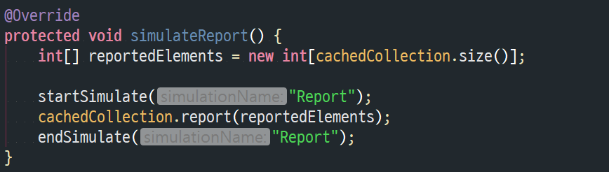

## Class Diagram

- Each implemented set is represented as 'IntSet...' class.
- The abstract 'IntSet' class provides all needed interfaces and utilities for concrete 'IntSet' classes.

- There are multiple operation simulators for each implemented set.
- Each simulator measures the time & space complexity of set.
- The abstarct 'IntSetSimulator' class provides all utilities for measuring complexity.

## Testing Implemented Sets
- All set structures are sharing test cases.
- For each set structure, there are 14 test cases.
- Below pictures & descriptions stand for only 'IntSetList' test cases, but other data structures have same test formats.

Test Case   | Type of test   | Description |
-------|--------|---------------| 
testSetMaxElement | Smoke Test | Tests the maximum number of elements can be accessed correctly through accessor method. |
testSetMaxValue | Smoke Test | Tests the maximum value of elements can be accessed correctly through accessor method. |
testNewListSize | Smoke Test | Tests the number of elements for a new created set is zero. |
testInsert | Smoke Test | Tests the single insert operation of set is working correctly for normal inputs. |
testMultipleInsert | Smoke Test | Tests the multiple insert operation of set is working correctly for normal inputs. |
testNormalElementsReport | Smoke Test | Test the report operation of set is working correctly for normal inputs. |

Test Case   | Type of test   | Description |
-------|--------|---------------| 
testCreateWithNegativeSize | Boundary Test | Tests an exception is thrown correctly when the maximum number of elements are less than zero. |
testDuplicateInsert | Boundary Test | Tests the single pair of insert operation for duplicate elements is handled correctly. |
testDuplicateMultipleInsert | Boundary Test | Tests the multiple pairs of insert operation for duplicate elements are handled correctly.  |
testOverMaxElementInsert | Boundary Test | Tests the insert operations after the set is full are ignored correctly. |
testOverMaxValueInsert | Boundary Test | Tests the insert operations are ignored correctly when the element exceeds the maximum value of elements. |
testDuplicateElementsReport | Boundary Test | Tests the report operation is working correctly after the multiple pairs of insert operation for duplicate elements.|

Test Case   | Type of test   | Description |
-------|--------|---------------| 
testReverseSortedElementsReport | Detail Test | Tests the report operation for reverse sorted inputs is working correctly. |
testAlreadySortedElementsReport | Detail Test | Tests the report operation for already sorted inputs is working correctly. |

## Test Result
- Test result for 'IntSetArr'.

- Test result for 'IntSetBins'.

- Test result for 'IntSetBitVector'.

- Test result for 'IntSetBst'.

- Test result for 'IntSetList'.

## Performance Analysis
- The simulation methods of each simulator class measure complexity of set operations.
- At the start of simulation, the timer is started.
- After the timer started, the method calls an operation of set several times.
- At the end of simulation, the timer is stopped.
- An example of simulation method is shown below.

- An example of simulation output is shown below.

- The timer behavior is implemented as below in the 'IntSetSimulator' class.

## Performance Analysis Result
### Notice
- The unit of time is second.
- The unit of space is byte.
- '0.000' means this is too fast operation to measure the performance.
- The repeated number of operations = 30000
- The point of performance tuning is avoiding too much method invocation. It increases used memory, and results lower performance. (This may sacrify the structure of code, but is good for performance/memory usage.)
### Result
- The maximum value of elements = 
- The maximum number of elements = (Maximum value of elements) / 100

Set | Time for initialize | Time for insert | Time for size | Time for report | Total Time |
-|-|-|-|-|-|
IntSetArr|34.880|0.298|0.000|0.015|35.193
IntSetList|0.012|6.167|0.000|0.117|6.296
IntSetBst|0.016|32.819|0.003|0.014|32.852
IntSetBitVector|0.010|80.315|0.002|0.455|80.782
IntSetBins|0.112|0.496|0.000|0.075|0.683

Set | Space for initialize | Space for insert | Space for size | Space for report | Total Space |
-|-|-|-|-|-|
IntSetArr|105308704|4194304|0|0|109503008
IntSetList|1977136|526336|0|1450808|3954280
IntSetBst|1574912|17299456|0|1048576|19922944
IntSetBitVector|2097152|31457280|0|1048576|34603008
IntSetBins|23595008|1574912|0|522240|25692160

- The maximum value of elements = 
- The maximum number of elements = (Maximum value of elements) / 50

Set | Time for initialize | Time for insert | Time for size | Time for report | Total Time |
-|-|-|-|-|-|
IntSetArr|52.640|0.283|0.000|0.014|52.937|
IntSetList|0.013|5.912|0.000|0.056|5.981
IntSetBst|0.007|27.849|0.003|0.010|27.869
IntSetBitVector|0.010|77.458|0.002|0.506|77.974
IntSetBins|0.071|0.346|0.000|0.045|0.462

Set | Space for initialize | Space for insert | Space for size | Space for report | Total Space |
-|-|-|-|-|-|
IntSetArr|356964384|8388608|0|0|365352992
IntSetList|1977160|526336|0|1012912|3516408
IntSetBst|1486480|17825792|0|928576|20240848
IntSetBitVector|2097152|32751324|0|608624|35457100
IntSetBins|23508624|1589536|0|314852|25413012

- The maximum value of elements = 
- The maximum number of elements = (Maximum value of elements) / 25

Set | Time for initialize | Time for insert | Time for size | Time for report | Total Time |
-|-|-|-|-|-|
IntSetArr|92.219|0.256|0.000|0.012|92.487
IntSetList|0.020|5.678|0.000|0.079|5.777
IntSetBst|0.028|23.433|0.002|0.010|23.463
IntSetBitVector|0.009|60.164|0.002|0.501|60.676
IntSetBins|0.059|0.257|0.000|0.036|0.352

Set | Space for initialize | Space for insert | Space for size | Space for report | Total Space |
-|-|-|-|-|-|
IntSetArr|315021344|16777216|0|0|331798560
IntSetList|1977152|526336|0|1450832|3954320
IntSetBst|1574912|17825792|0|1048576|20449280
IntSetBitVector|2097152|33554432|0|928568|36580152
IntSetBins|23595008|1446376|0|485132|25526516

- The maximum value of elements = 
- The maximum number of elements = (Maximum value of elements) / 100

Set | Time for initialize | Time for insert | Time for size | Time for report | Total Time |
-|-|-|-|-|-|
IntSetArr|0.561|0.066|0.000|0.006|0.633
IntSetList|0.014|2.913|0.000|0.028|2.955
IntSetBst|0.009|9.740|0.001|0.005|9.755
IntSetBitVector|0.008|0.454|0.000|0.022|0.484
IntSetBins|0.050|0.064|0.000|0.023|0.137

Set | Space for initialize | Space for insert | Space for size | Space for report | Total Space |
-|-|-|-|-|-|
IntSetArr|43565976|2320210|0|0|45886186
IntSetList|1972712|526336|0|1048576|3547624
IntSetBst|1570816|5765120|0|526336|7862272
IntSetBitVector|2097152|295160|0|524288|2916600
IntSetBins|23784120|526336|0|298654|24609110

- The maximum value of elements = 
- The maximum number of elements = (Maximum value of elements) / 50

Set | Time for initialize | Time for insert | Time for size | Time for report | Total Time |
-|-|-|-|-|-|
IntSetArr|1.206|0.206|0.000|0.013|1.425
IntSetList|0.013|5.754|0.000|0.035|5.802
IntSetBst|0.010|19.925|0.001|0.007|19.943
IntSetBitVector|0.007|0.525|0.000|0.029|0.561
IntSetBins|0.056|0.141|0.000|0.032|0.229

Set | Space for initialize | Space for insert | Space for size | Space for report | Total Space |
-|-|-|-|-|-|
IntSetArr|308231024|16415578|0|0|324646602
IntSetList|1492848|526336|0|1084024|3103208
IntSetBst|1535368|11534336|0|608624|13678328
IntSetBitVector|2014864|454019|0|968560|3437443
IntSetBins|23590912|971664|0|532147|25094723

- The maximum value of elements = 
- The maximum number of elements = (Maximum value of elements) / 25

Set | Time for initialize | Time for insert | Time for size | Time for report | Total Time |
-|-|-|-|-|-|
IntSetArr|1.742|0.292|0.000|0.017|2.051
IntSetList|0.012|6.479|0.000|0.048|6.539
IntSetBst|0.008|25.071|0.003|0.012|25.094
IntSetBitVector|0.008|0.480|0.000|0.029|0.517
IntSetBins|0.063|0.416|0.000|0.040|0.519

Set | Space for initialize | Space for insert | Space for size | Space for report | Total Space |
-|-|-|-|-|-|
IntSetArr|244007792|12995216|0|0|257003008
IntSetList|2097152|526336|0|1570816|4194304
IntSetBst|1574912|17825792|0|1048576|20449280
IntSetBitVector|2097152|230672|0|1226072|3553896
IntSetBins|23590912|1488528|0|528400|25607840

## Performance Rank
### Memory Usage
1. Array
2. Bins
3. Binary Search Tree
4. Simple List
5. Bit Vector
### Performance
1. Bins
2. Bit Vector
3. Array
4. Simple List
5. Binary Search Tree
